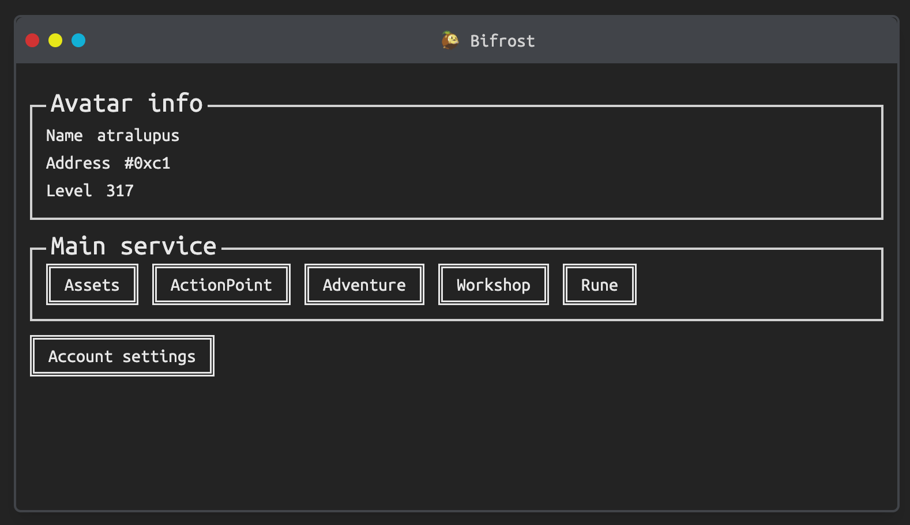

# Bifrost

Bifrost는 [나인크로니클](https://nine-chronicles.com/)의 Lite Web Client입니다.  
나인크로니클의 계정을 웹에서 관리할 수 있는 Chrome Wallet인 [Chrono](https://nine-chronicles.dev/guide/general/how-to-use-chrono)를 사용해 웹에서 게임을 즐겨보세요

## 플레이 방법

Bifrost의 사용법은 기존 게임 client와는 조금 다릅니다. 보안을 위해 계정을 직접 관리하는 것이 아닌 지갑을 통해 관리하기 때문에 매 액션마다 지갑을 통해 서명을 진행해줘야합니다.  

### 준비

1. [Chrono를 설치](https://chromewebstore.google.com/detail/chrono-development-build/gcloogpfjklfhgfddenekamfjgbcklic)해주세요.
2. 게임을 플레이하던 아바타가 있는 private key를 불러와야합니다. [Import Guide](https://nine-chronicles.dev/guide/general/how-to-use-chrono#register-private-key)를 통해 플레이가 가능한 계정을 불러와주세요.
3. Bifrost에 접속해주세요. https://bifrost.not-blond-beard.games/
4. Account Settings에서 아바타를 조회하고 원하는 아바타를 선택 한 후 플레이합니다.

### 서명

서명이 필요한 기능을 사용할 땐 Chrono를 통해 서명을 진행합니다.  
예를 들어 모험을 진행할 땐 스테이지를 클릭하면 아래와 같이 Chrono에 서명을 요구합니다.
  
비밀번호를 치고 나면  
  
`type_id`에 `hack_and_slash22` 즉 전투를 진행하겠다는 액션을 넣어 서명하는걸 확인할 수 있습니다. 이렇게 각 액션마다 어떤 내용을 서명하는지 확인한 후 허가를 해주면 Bifrost에서 서명을 했던 tx를 9cscan에서 볼 수 있도록 연결해줍니다.

## Mimir

Bifrost는 기본적으로 [Mimir](https://github.com/planetarium/mimir)를 사용해 데이터를 제공합니다.  
게임 데이터들은 mimir에서 받아서 제공하며 서명을 해 tx를 전송할 땐 [Headless](https://github.com/planetarium/NineChronicles.Headless)에 전달해 전송하게됩니다.
