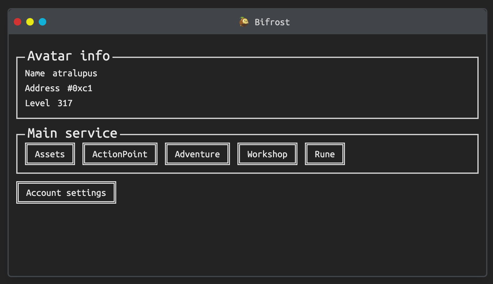
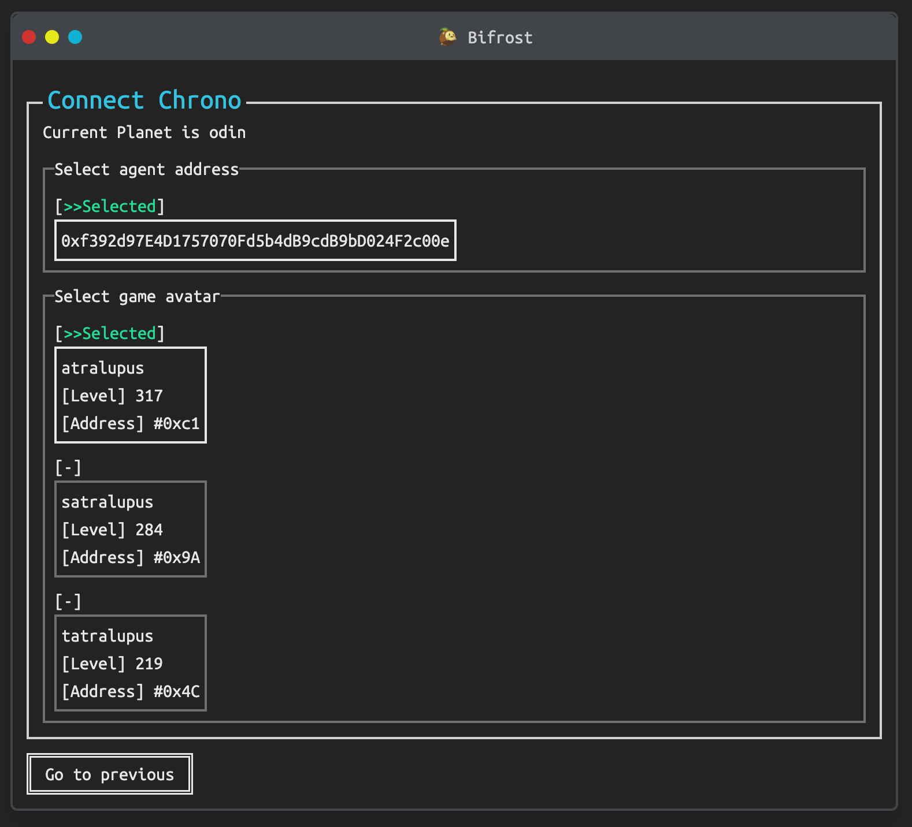
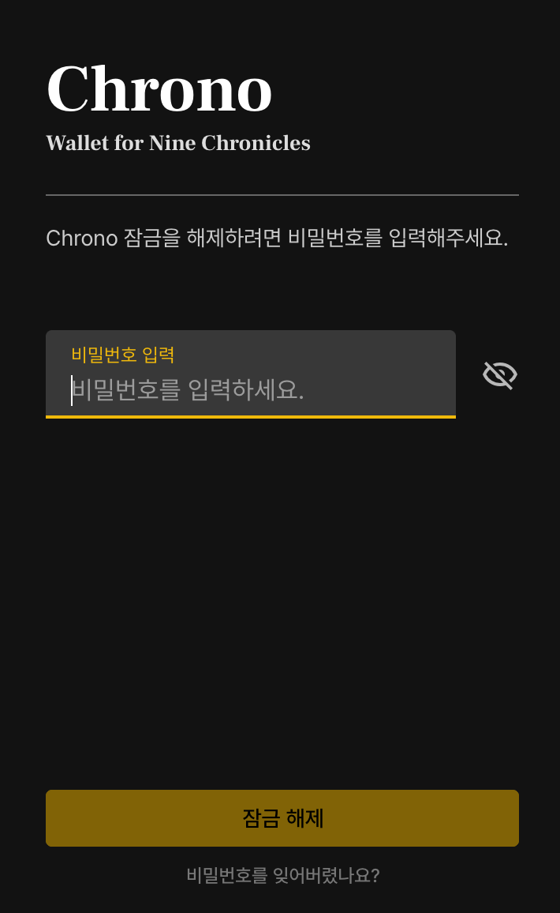
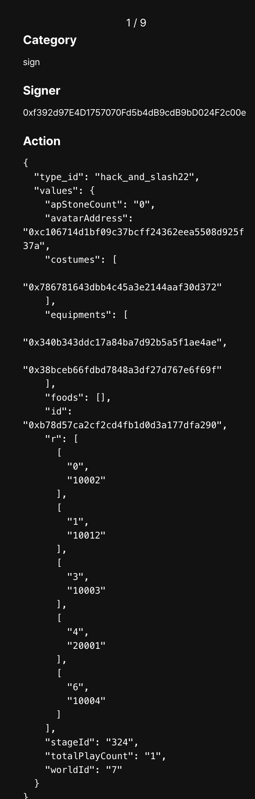

# Bifrost

Bifrost is the Lite Web Client for [Nine Chronicles](https://nine-chronicles.com/).  
Manage your Nine Chronicles account on the web using the Chrome wallet, [Chrono](https://nine-chronicles.dev/guide/general/how-to-use-chrono), and enjoy the game directly in your browser.  

## How to Play

Unlike traditional game clients, Bifrost uses a wallet-based system for enhanced security. Each action requires a signature through the wallet.

### Setup

1. [Install Chrono](https://chromewebstore.google.com/detail/chrono-development-build/gcloogpfjklfhgfddenekamfjgbcklic).
2. Import the private key of your avatar account. Follow the [Import Guide](https://nine-chronicles.dev/guide/general/how-to-use-chrono#register-private-key) to load a playable account.
3. Access Bifrost: [https://bifrost.not-blond-beard.games/](https://bifrost.not-blond-beard.games/).
4. In the **Account Settings**, select your avatar and start playing.  
   

### Signing Actions

When performing actions that require a signature, Chrono will prompt you to confirm.  
For example, starting an adventure will show a signature request like this:  
  
Enter your password, and you'll see the details of the action (e.g., `type_id: hack_and_slash22`) to confirm the transaction.  
  
Once signed, the transaction will be viewable on [9cscan](https://9cscan.com/).

## Mimir

Bifrost relies on [Mimir](https://github.com/planetarium/mimir) to fetch game data. Transactions are sent to [Headless](https://github.com/planetarium/NineChronicles.Headless) for processing.
